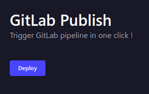

# Strapi plugin gitlab-publish

[![NPM version][npm-image]][npm-url]
[![PR Welcome][npm-downloads-image]][npm-downloads-url]

This is a plugin for [Strapi](https://github.com/strapi/strapi) headless CMS. It lets you trigger a GitLab Action workflow when the site is ready to be published.

Inspired by [strapi-plugin-github-publish](https://github.com/phantomstudios/strapi-plugin-github-publish) project, thanks to [Phantom](https://github.com/phantomstudios) for his work !<br>

## Introduction



When using Strapi as a headless CMS for a statically built website you need a way to trigger the site to rebuild when content has been updated. The typical approach is to setup a Strapi managed webhook to trigger a CI/CD pipeline whenever content changes. This approach has it's issues. For example when making many changes to content, builds are triggered multiple times and deployments can fail due to the site being deployed concurrently.

This plugin tackles the publishing flow a different way. The site administrators can take their time and make many changes and once the content update is complete they can trigger a single build.

## Installation

Install this plugin with npm / yarn / pnpm.

With npm:

```bash
npm install strapi-plugin-github-publish
```

With yarn:

```bash
yarn add strapi-plugin-github-publish
```

With pnpm:

```bash
pnpm add strapi-plugin-github-publish
```

## Configuration

Generate a config file at `config/plugins.js` or `config/development/plugins.js` etc...

```javascript
module.exports = ({ env }) => ({
  "github-publish": {
    enabled: true,
    config: {
      project_id: env("GITLAB_PROJECT_ID"),
      project_branch: env("GITLAB_PROJECT_BRANCH"),
      project_pipeline_token: env("GITLAB_PROJECT_PIPELINE_TOKEN"),
    },
  },
});
```

Make sure you have variable in your .env file

```bash
GITLAB_PROJECT_ID=tobemodified
GITLAB_PROJECT_BRANCH=tobemodified
GITLAB_PROJECT_PIPELINE_TOKEN=tobemodified
```

## Use the Plugin

When the plugin has been installed correctly just click on `GitLab Publish` in the sidebar under plugins then click "Publish".

[npm-image]: https://img.shields.io/npm/v/strapi-plugin-gitlab-publish.svg?style=flat-square&logo=react
[npm-url]: https://npmjs.org/package/strapi-plugin-gitlab-publish
[npm-downloads-image]: https://img.shields.io/npm/dm/strapi-plugin-gitlab-publish.svg
[npm-downloads-url]: https://npmcharts.com/compare/strapi-plugin-gitlab-publish?minimal=true
[ci-image]: https://github.com/Striffly/strapi-plugin-gitlab-publish/workflows/Test/badge.svg
[ci-url]: https://github.com/Striffly/strapi-plugin-gitlab-publish/actions
